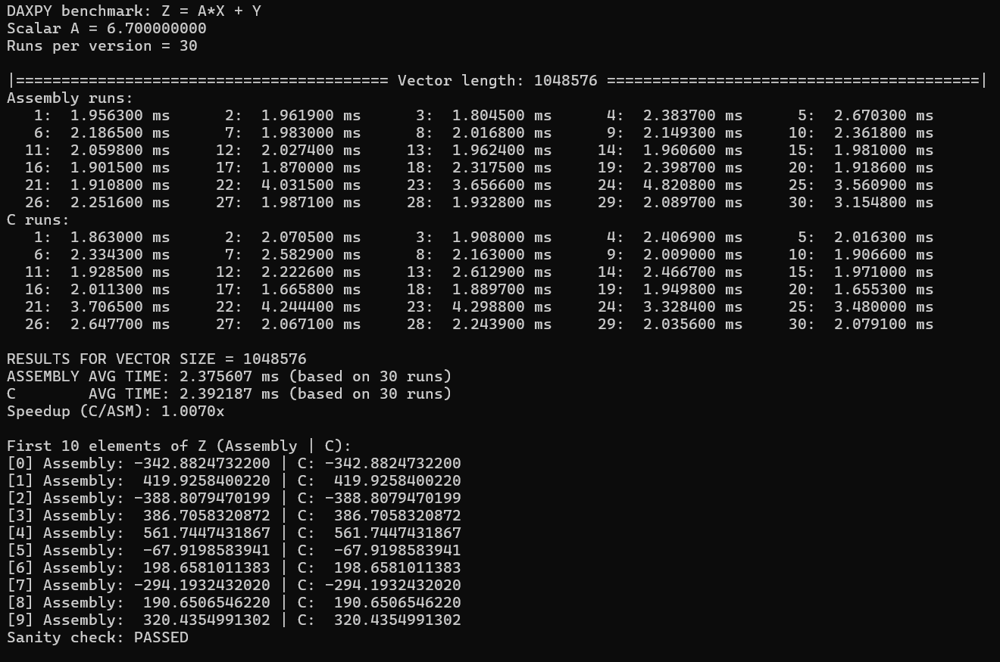
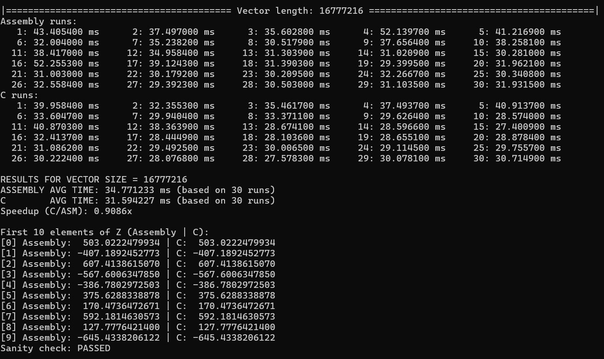
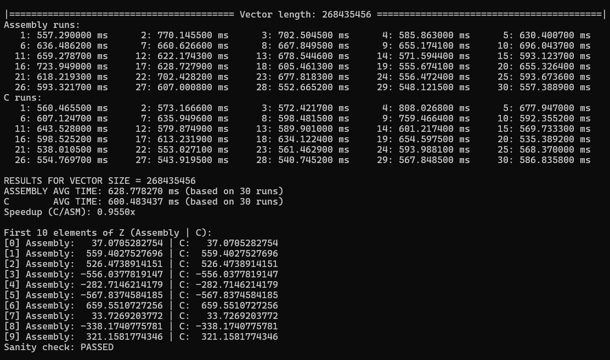

# Performance Comparison: Assembly vs C Implementation of DAXPY
*Made by: Anthony Baybayon && Mariel Tamondong (LBYARCH S20A)*

This project evaluates the performance characteristics of Assembly and C implementations of the DAXPY operation: `Z[i] = A*X[i] + Y[i]`

## Methodology

Two implementations of the same mathematical operation were developed:
- x86-64 Assembly language implementation 
- C language implementation 

Performance benchmarks were conducted across multiple vector sizes (2^20, 2^24, 2^30) to determine efficiency.

## Results

Thirty iterations were performed for each implementation across different vector sizes:

| Vector Size | Assembly (ms) | C (ms) | Performance Leader |
|-------------|---------------|--------|-------------------|
| Small (2^20) | 2.376 | 2.392 | Assembly |
| Medium (2^24) | 34.771 | 31.594 | C |
| Large (2^28) | 628.778 | 600.483 | C |

### Detailed Execution Results

**Small Vector Size (2^20 elements):**

**Medium Vector Size (2^24 elements):**

**Large Vector Size (2^28 elements):**

## Analysis

1. **Small datasets (2^20 elements)**: Assembly demonstrates marginally superior performance (0.7% improvement)
2. **Medium datasets (2^24 elements)**: C implementation shows significant performance gains (9.1% improvement)
3. **Large datasets (2^28 elements)**: C maintains performance advantage (4.5% improvement)

**Note: These results vary as there are runs wherein Assembly is better than C in various vector sizes, but difference was consistently less than 10%**

## Discussion

The results demonstrate that modern C compilers provide competitive and often superior performance compared to hand-optimized assembly code. The C implementation's advantages stem primarily from sophisticated compiler optimizations and the simplicity of the DAXPY operation. Key factors contributing to C's superior performance include:

- **Automatic vectorization**: Compilers automatically use special instructions that work on multiple numbers at once
  - *Assembly limitation*: You must write these special instructions yourself
  
- **Loop unrolling**: Compilers reduce the overhead of repeating loops by doing more work in each iteration
  - *Assembly limitation*: You must manually copy and paste loop code to unroll it
  
- **Register allocation**: Compilers efficiently manage processor registers better than manual coding
  - *Assembly limitation*: You must keep track of which registers hold what data yourself

Optimizations in Assembly need to be implemented by the programmer, which often requires a deeper understanding of the language.

## Conclusions

The simplicity of the DAXPY operation (linear memory access pattern with straightforward arithmetic) allows compilers to apply these optimizations effectively, often surpassing hand-tuned assembly code while maintaining code readability and portability across different architectures.

